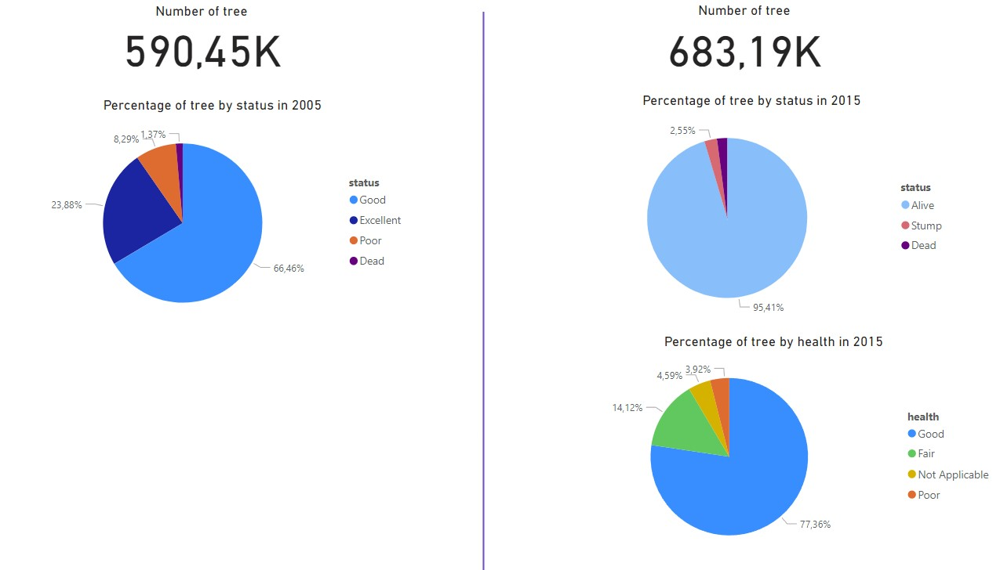
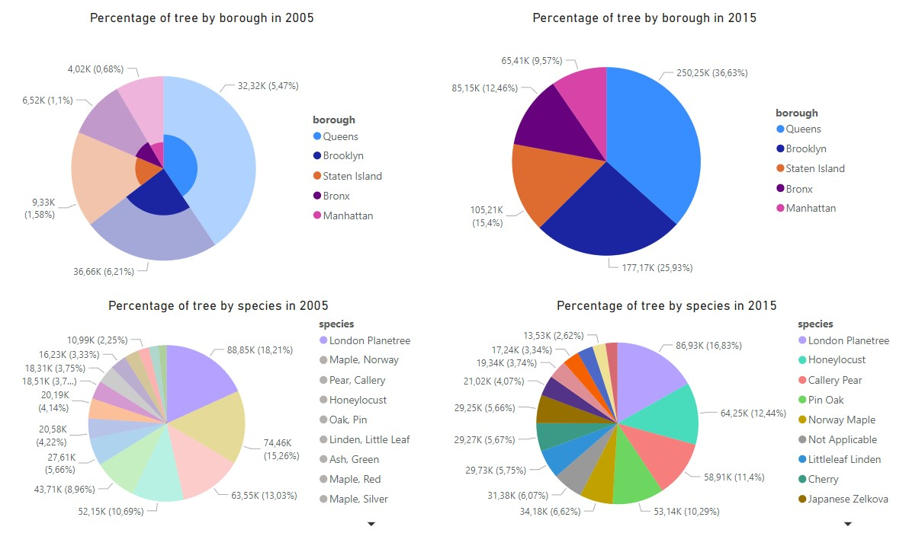
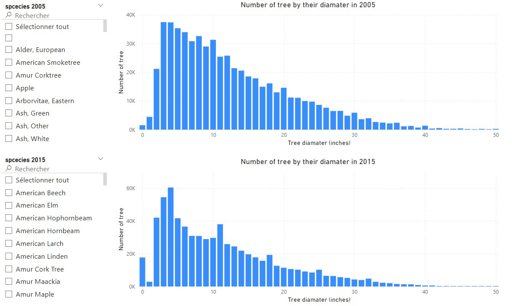

# Tree cencus in NY
**How does the tree population in New-York city between 2005 et 2015 ?**
>
The 2 data set were obtained from the Open Data New York website. The first one correspond to [the 2005 cencus](https://data.cityofnewyork.us/Environment/2005-Street-Tree-Census/29bw-z7pj) and the second one to [the 2015 cencus](https://data.cityofnewyork.us/Environment/2015-Street-Tree-Census-Tree-Data/uvpi-gqnh). With each data set a pdf file is provided caintaining a description of the differents columns. Each of the data set contain around 600k rows and one row is equal to a tree. They contain information on the trees such as their diamater, the species, their health or even their location.
>
The first step was to get familiar with the data and to clean it in Python. Several observations were made :
  - A few of the columns were not interesting for us and were removed
  - A few columns (different ones in both dataset) contained missing values (NaN). They were replaced by appropriate value depending on the colummns.
  - A certain number of values for the tree and stump diamater were too high to be realistic : 364 in 2005 et 1921 in 2015. A threshold of 50 inches was choosed and all the tree/stump with a diamater higher than 50 inches were removed from the dataset.
  - Some of the columns had different posible values to give the same information. For exemple, the status of a tree could be described as good, excelent, poor or dead in 2005. In 2015 it could be described as alive, stump or dead but they added another column called health to specify if the tree is considered in good, fair or poor health or if this criteria was not applicable. In order to illustrate the changed made to the cencus system between the years it was decided to not change the values of the different columns to match them between the 2 dataset.
>
A new CSV file was obtained and used to create a dashboard in Power BI. Through data visualization, several observations were made:
  - This visual showed the difference in the number of trees and their status/health. It was observed that the overall number of trees had increased in the past 10 years, but the number of dead trees had also increased.
>  

>
  - This visual revealed the distribution of tree species across different boroughs.
>

>
  - With this visual the number of tree is represented in function of their diamater. Thanks to a segment one or several species can be selected to observe their diamater
>

>
  Another visual represented the number of trees based on their diameter, with a segment allowing for the selection of one or more species for further observation.       This visual highlighted a few trees with a 0-inch diameter, which could be due to the census form rounding values lower than 1 to 0. Additionally, it was noted that   there were no values higher than 50, as explained earlier.
